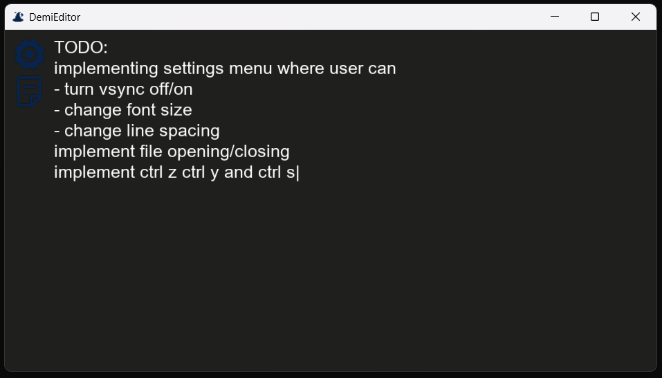

## DemiEditor

A work in progress lightweight text editor written in C using opengl, freetype and libpng that runs out of the box.



*a screenshot of glew opened in demi 0.6*

### Table of Contents

- [Project Structure](#project-structure)
- [Project Plans](#project-plans)
- [Credits](#credits)
- [Linux](#linux)
- [Build Instructions](#compilation)
- [Version History](#version-history)

### Project Structure

The project is structured to separate platform-specific code from core editor logic without creating a platform abstraction layer; win_main.c is the entry point, it manages the window and calls editor.h for everything related to the editor's logic and rendering.


```bash
src/
├── win_main.c         # main function, program loop and window management
├── win_error.c        # debug and error handling for Windows
├── includes.h         # global includes and macros
├── editor.h           # editor logic and rendering, split into editor.c and settings.c
├── character/         # Character handling and buffer system
├── textures/          # Texture abstraction
├── shader/            # Shader compilation and uniform handling
├── objects/           # VAO and VBO abstraction
├── cursor/            # Cursor rendering and position handling
├── math/              # 4x4 matrix math functions
resources/
├── fonts/
├── icons/
├── shaders/
```
### Project Plans

I got into this project with close to no experience graphics programming and creating bigger projects in C, thus a lot of this project is placeholder or unintentionally wrong.

Short Term Goals:
- line counting
- ctrl z, ctrl y
- ctrl + arrow to jump every second line
- process and store 15 000 characters regardless of hardware
- vertical and horizontal scroll bars
- restructure editor to allow for multiple files
- ui redesign
- custom fonts

### Credits

- icons by [mingcute](https://www.mingcute.com/), icons used:
    - magic_hat
    - close_fill
    - settings_5_fill
    - document_2_line
- glew
- zlib
- libpng
- freetype

### Linux

As of current, linux is not supported. I intend wayland support once the app is feature complete.

### compilation

requirements:

- msvc c compiler
- glew
- zlib
- libpng
- freetype2

*My build instructions are IDE independent and optional*

Launch debug.bat or release.bat depending on whether you want to compile a debug or release version.

> [!NOTE]
> Ensure paths and variables in .bat files match your setup 

I build libraries myself to avoid missmatches between /MD and /MT alongside other frustrating windows compilation problems.

I chose to statically link everything to avoid dependencies; the program is too tiny to worry about several instances of it requiring too many resources.

#### compiler

I use [LLVM clang-cl](https://clang.llvm.org/), which requires visual studio or it's build tools, more specifically:
- C++ development 
- C++ Clang Compiler for Windows
- MSBuild support for LLVM (clang-cli) toolset

> [!NOTE]
> Add LLVM's bin/ directory to your system PATH

#### glew

The exception to building things myself due to the non make build systems for glew being far from ideal.

[glew release](https://github.com/nigels-com/glew/releases/tag/glew-2.2.0)

#### freetype2

[freetype source](https://gitlab.freedesktop.org/freetype/freetype)

```
cmake C:\Users\frogger\Downloads\freetype-master -G Ninja ^
-DCMAKE_MSVC_RUNTIME_LIBRARY="MultiThreaded" ^
-DCMAKE_BUILD_TYPE=Release ^
-DBUILD_SHARED_LIBS=OFF ^
-DCMAKE_AR="llvm-lib.exe" ^
-DCMAKE_LINKER="lld-link.exe" ^
-DCMAKE_C_COMPILER=clang-cl ^
-DCMAKE_C_FLAGS="/MT /DNDEBUG /Ox" ^
-DFT_REQUIRE_ZLIB=OFF ^
-DFT_REQUIRE_PNG=OFF ^
-DFT_REQUIRE_BZIP2=OFF ^
-DFT_REQUIRE_HARFBUZZ=OFF ^
-DFT_REQUIRE_BROTLI=OFF ^
-DCMAKE_INSTALL_PREFIX=C:\libraries\freetype

cmake --build . --config Release
cmake --install . --config Release
```

#### zlib

[zlib source](https://github.com/madler/zlib)

> [!WARNING]
> enabling optimizations on zlib will break the library

```
cmake C:\Users\frogger\Downloads\zlib-develop -G Ninja ^
-DCMAKE_MSVC_RUNTIME_LIBRARY="MultiThreaded" ^
-DCMAKE_BUILD_TYPE=Release ^
-DZLIB_BUILD_TESTING=OFF ^
-DZLIB_BUILD_SHARED=OFF ^
-DZLIB_BUILD_STATIC=ON ^
-DBUILD_SHARED_LIBS=OFF ^
-DCMAKE_AR="llvm-lib.exe" ^
-DCMAKE_LINKER="lld-link.exe" ^
-DCMAKE_C_COMPILER=clang-cl ^
-DCMAKE_C_FLAGS="/MT /DNDEBUG" ^
-DCMAKE_INSTALL_PREFIX=C:\libraries\zlib

cmake --build . --config Release
cmake --install . --config Release
```

#### libpng

[libpng source](http://www.libpng.org/pub/png/libpng.html)

```
cmake C:\Users\frogger\Downloads\lpng1648 -G Ninja ^
-DCMAKE_MSVC_RUNTIME_LIBRARY="MultiThreaded" ^
-DCMAKE_BUILD_TYPE=Release ^
-DPNG_TESTS=OFF ^
-DPNG_SHARED=OFF ^
-DPNG_STATIC=ON ^
-DBUILD_SHARED_LIBS=OFF ^
-DCMAKE_AR="llvm-lib.exe" ^
-DCMAKE_LINKER="lld-link.exe" ^
-DCMAKE_C_COMPILER=clang-cl ^
-DCMAKE_C_FLAGS="/MT /DNDEBUG" ^
-DZLIB_LIBRARY="C:\libraries\zlib\lib\zs.lib" ^
-DZLIB_INCLUDE_DIR="C:\libraries\zlib\include" ^
-DCMAKE_INSTALL_PREFIX="C:\libraries\libpng" 

cmake --build . --config Release
cmake --install . --config Release
```

### Version History

`0.6` -> changelog:
- fixed editor_left_click
- change from ANSII to UNICODE
- added file saving (ctrl s)
- added file opening
- added settings menu with adjustable:
    - font size
    - line spacing
    - scroll speed

`0.5` -> changelog:
- fixed editor_left_click (but not really, forgot to adjust for camera_x and camera_y)
- added settings icon and file icon
- added png to texture abstraction
- replacing validation of chars with validation before getting added to buffer (editor_input editor_paste)

`0.4` -> changelog:
- ctrl+v
- scrolling text
- moving via mouse
- improved key up/down
- safety checks in to delete char, WM_CHAR default and render text
- skipping rendering and calculations for text above/below the camera
- replacing `cursor_update_position` from editor loop to where the cursor position changes

`0.3` -> First working demo. Obscure in features, doesn't actually edit files and limited to keyboard movement.

*p.s. structural and minor changes are left undocumented*