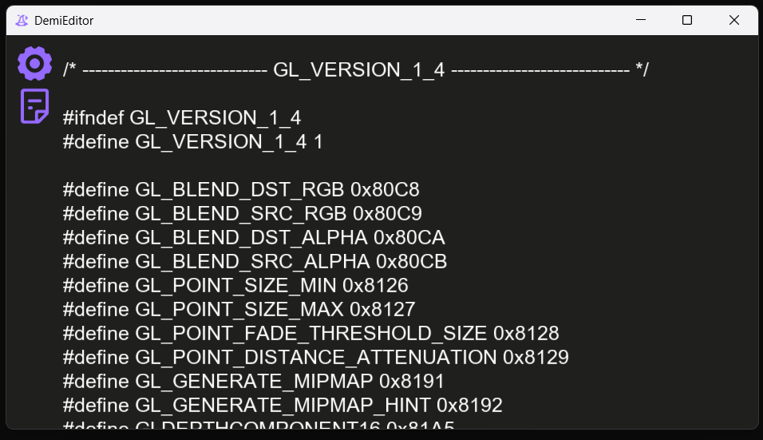

## DemiEditor

Editor written in C using opengl and freetype that runs out of the box.

## Table of Contents

- [Linux](#linux)
- [Build Instructions](#compilation)

> [!NOTE]
> I will document the source code as well as the functionalities once I complete the short term todo list



### Linux

As of current, linux is not supported. I intend wayland support once the app is feature complete and restructured.

### compilation

build.bat compiles the project and creates a shortcut; Modify the COMPILER, INCLUDES and LIBRARIES variables to be true for your setup, then launch build.bat.

requirements:

- c compiler
- glew
- freetype2

#### compiler

no compiler specific code is writen, and thus any will work

I use mingw gcc from [winlibs](https://winlibs.com/)

clang LLVM needs `--target=x86_64-w64-windows-gnu` to use libraries meant for mingw

#### glew

I statically linked [msys2 glew](https://packages.msys2.org/packages/mingw-w64-x86_64-glew), however any build is fine

#### freetype2

I built freetype myself to minimize dependencies; my setup requires cmake (which is included in winlibs build of gcc and mingw) and zlib (here's a [msys2](https://packages.msys2.org/packages/mingw-w64-x86_64-zlib) build)

```
cmake -G "MinGW Makefiles" ^
-D CMAKE_BUILD_TYPE=Release ^
-D FT_WITH_ZLIB=ON ^
-D ZLIB_INCLUDE_DIR=zlib_include_path ^
-D ZLIB_LIBRARY=libz.a_path ^
-D FT_WITH_BZIP2=OFF ^
-D FT_WITH_PNG=OFF ^
-D FT_WITH_HARFBUZZ=OFF ^
-D FT_WITH_BROTLI=OFF ^
-D CMAKE_INSTALL_PREFIX=install_path ^
-S source_path ^
-B build_path ^
-D BUILD_SHARED_LIBS=ON

mingw32-make
mingw32-make install
```